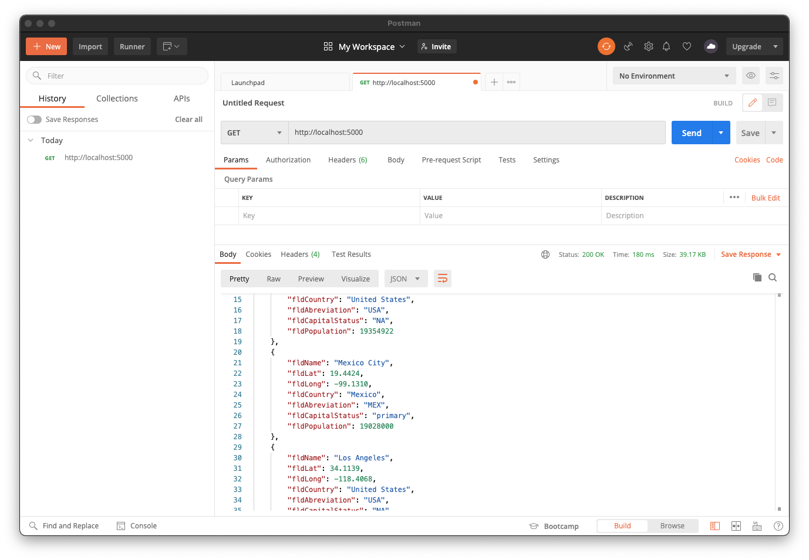
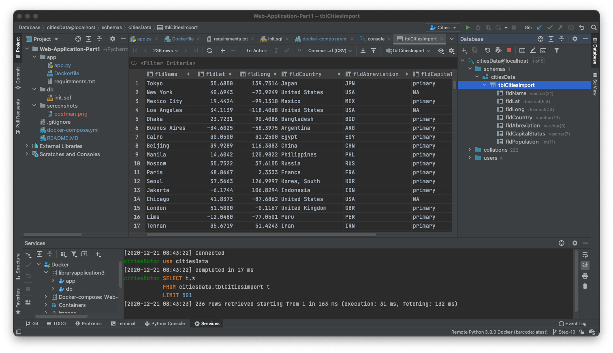
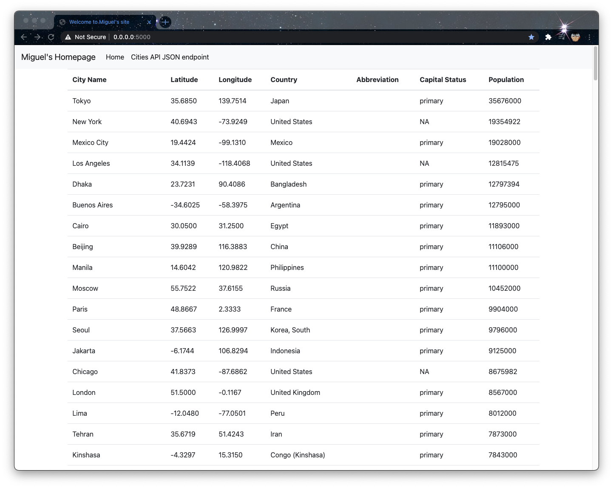

#Project Description 
This project is a homework assignment to teach how to get a Pycharm environment setup with Docker, Flask, and Mysql 
#Postman Screenshot 

#SQL Data Screenshot

#Table Data Screenshot
